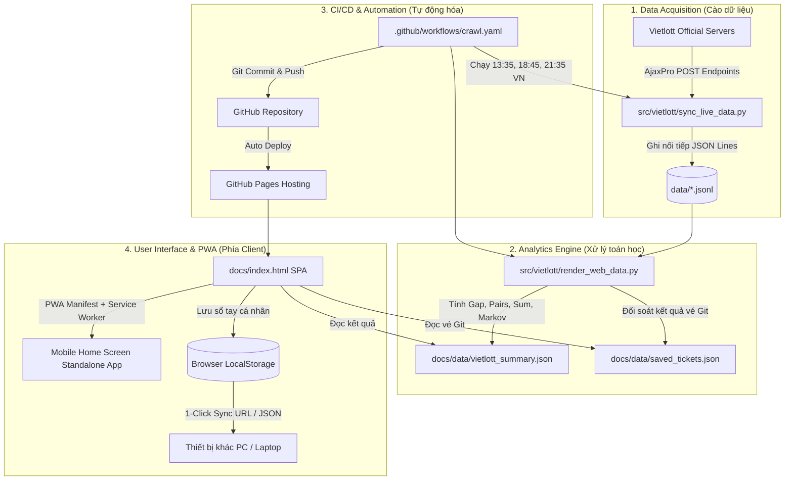

# KIẾN TRÚC TỔNG THỂ HỆ THỐNG (SYSTEM ARCHITECTURE)
## DỰ ÁN: VIETLOTT DATA ANALYTICS & LIVE EXPLORER

---

## 1. TỔNG QUAN HỆ THỐNG (HIGH-LEVEL OVERVIEW)

Hệ thống **Vietlott Analytics Hub** là nền tảng khai phá dữ liệu, phân tích xác suất thống kê và hỗ trợ chiến lược chọn số thông minh cho các loại hình xổ số ma trận của Vietlott (**Power 6/55, Mega 6/45, Power 5/35**).

Hệ thống được thiết kế theo kiến trúc **Serverless JAMstack & Hybrid Synchronization**:
1. **Data Ingestion Layer (Python Crawler):** Tự động thu thập dữ liệu kết quả từ cổng API chính thức của Vietlott qua các tác vụ định kỳ (GitHub Actions Cron).
2. **Analytical & Processing Engine (Python Data Pipeline):** Làm sạch, chuẩn hóa, phân tích chu kỳ nhịp, số gan, phân phối tổng, chuỗi Markov và kết xuất file tổng hợp siêu nhẹ (`docs/data/vietlott_summary.json`).
3. **Presentation Layer (Modern SPA & PWA):** Ứng dụng web đơn trang (Single Page Application) không phụ thuộc framework nặng, tích hợp Progressive Web App (PWA) để cài đặt toàn màn hình trên điện thoại.
4. **Hybrid Persistence & Synchronization Layer:** Kết hợp giữa `localStorage` trên máy người dùng, đồng bộ qua liên kết URL 1-chạm (`?sync=`) và kho lưu trữ tập trung trên Git (`data/saved_tickets.json`).

---

## 2. BIỂU ĐỒ LUỒNG DỮ LIỆU (DATA FLOW DIAGRAM)



---

## 3. CẤU TRÚC THƯ MỤC CHI TIẾT (DIRECTORY TREE & RESPONSIBILITY)

```text
vietlott-data-master/
├── .agents/                        # Bộ kỹ năng AI chuyên sâu phục vụ phát triển & audit
│   └── skills/
│       ├── production-code-audit/  # Rà soát mã nguồn doanh nghiệp, tối ưu hiệu năng
│       ├── progressive-web-app/    # Hướng dẫn & cấu hình PWA, Service Worker, Manifest
│       ├── quant-analyst/          # Mô hình toán học định lượng, kiểm định giả thuyết
│       ├── ui-ux-pro-max/          # Thiết kế UI/UX mobile-first, hệ thống màu sắc
│       └── web-scraper/            # Kỹ thuật cào dữ liệu bền bỉ & chống nghẽn
│
├── .github/
│   └── workflows/
│       └── crawl.yaml              # Workflow GitHub Actions tự động hóa 4 khung giờ mỗi ngày
│
├── bin/
│   └── github_data.sh              # Bash script điều phối quy trình cào & xuất file trên CI runner
│
├── data/                           # Kho dữ liệu gốc dạng JSON Lines (Raw Historical Datasets)
│   ├── power655.jsonl              # Toàn bộ lịch sử quay thưởng Power 6/55 (từ kỳ 00001)
│   ├── power645.jsonl              # Toàn bộ lịch sử quay thưởng Mega 6/45 (từ kỳ 00001)
│   ├── power535.jsonl              # Lịch sử quay thưởng Power 5/35 (13h và 21h hàng ngày)
│   ├── 3d.jsonl                    # Dữ liệu Max 3D
│   ├── 3d_pro.jsonl                # Dữ liệu Max 3D Pro
│   └── saved_tickets.json          # Sổ tay vé được đồng bộ và lưu trữ trực tiếp trên Git
│
├── docs/                           # Thư mục xuất bản GitHub Pages (Web Root)
│   ├── assets/                     # Tài nguyên tĩnh đã được module hóa
│   │   ├── css/
│   │   │   └── styles.css          # Định dạng 3D lotto ball, animation, scrollbars tùy biến
│   │   └── js/
│   │       ├── core.js             # State toàn cục, PWA, Audio, Dropdown, Menu & Navigation
│   │       ├── common_analytics.js # Dò vé, Hero, Số gan, Cặp số, Phân tích tổng, Mẫu hình, Lịch sử
│   │       ├── advanced_quant.js   # Vị trí, AC Complexity, Delta, Markov, +EV, Wheeling, Bạc Nhớ
│   │       ├── consensus_ensemble.js# Trí tuệ đám đông (Consensus), Seeded PRNG, Ensemble, Đếm ngược
│   │       └── notebook_bao7.js    # Sổ tay vé cá nhân (LocalStorage, Sync), Chiến lược Bao 7 & SMS 9969
│   ├── data/
│   │   ├── vietlott_summary.json   # File JSON tổng hợp phân tích (~360KB) nạp vào Web UI
│   │   └── saved_tickets.json      # File vé đồng bộ từ Git nạp vào Sổ Tay Web UI
│   ├── architecture/               # Hệ thống tài liệu kiến trúc & tham chiếu chi tiết
│   │   ├── SYSTEM_ARCHITECTURE.md  # File này (Kiến trúc tổng thể hệ thống)
│   │   ├── DATA_PIPELINE_REFERENCE.md # Đặc tả chi tiết Data Pipeline & ETL
│   │   ├── FRONTEND_COMPONENT_MAP.md  # Bản đồ component & module giao diện
│   │   ├── MATHEMATICAL_MODELS.md     # Mô hình toán học, xác suất & Walk-Forward
│   │   ├── vietlott-architecture.html # Sơ đồ kiến trúc tương tác Archify
│   │   └── vietlott-architecture.json # File đặc tả kiến trúc Archify
│   ├── apple-touch-icon.png        # Icon Retina chuẩn 180x180 cho iPhone/iPad Standalone
│   ├── icon-192.png & icon-512.png # Icon PWA chuẩn cho Android / Desktop
│   ├── manifest.json               # Cấu hình PWA Web App Manifest
│   ├── sw.js                       # Service Worker Cache Storage v1.1 xử lý Offline mode
│   └── index.html                  # Khung giao diện HTML tinh gọn (~2.340 dòng)
│
├── src/                            # Mã nguồn lõi Python
│   ├── vietlott/
│   │   ├── sync_live_data.py       # Script chính cào trực tiếp kết quả mới nhất từ Vietlott
│   │   ├── render_web_data.py      # Script tính toán phân tích toán học & kết xuất JSON
│   │   ├── crawler/                # Các lớp crawler module hóa cho từng sản phẩm
│   │   └── model/                  # Các module thuật toán & chiến lược dự đoán
│   └── render_readme.py            # Cập nhật README.md tự động
│
├── assets/                         # Bản sao đồng bộ của docs/assets phục vụ root server
├── index.html                      # Bản sao của docs/index.html phục vụ root server
├── manifest.json & sw.js           # Bản sao PWA phục vụ root server
└── requirements.txt                # Danh sách thư viện phụ thuộc Python
```

---

## 4. BẢNG TIÊU CHUẨN CÔNG NGHỆ (TECH STACK)

| Tầng (Layer) | Công nghệ | Mục đích |
|---|---|---|
| **Crawler Engine** | Python 3.11+, `requests`, `beautifulsoup4` | Gọi API AjaxPro và bóc tách dữ liệu lồng cầu Vietlott |
| **Data Processing** | Python standard (`json`, `collections`, `itertools`, `math`) | Tính toán tần suất, ma trận nhịp gan, chuỗi Markov với độ phức tạp $O(N)$ |
| **CI/CD Automation** | GitHub Actions (`ubuntu-latest`) | Lên lịch chạy tự động 4 lần/ngày hoàn toàn miễn phí |
| **Web Presentation** | Pure Vanilla JavaScript ES6+, HTML5 | Hiệu năng render tối đa, không phát sinh overhead từ React/Vue |
| **CSS Framework** | Tailwind CSS (JIT Engine via CDN) | Giao diện tối hiện đại (Dark Theme) tối ưu cho màn hình OLED |
| **Data Visualization** | Chart.js 4.x + Lucide Icons + Canvas Confetti | Biểu đồ chuông Gaussian, đường xu hướng tổng, pháo hoa khi trúng |
| **PWA Standalone** | Service Worker Cache API + Web App Manifest | Cài đặt trực tiếp lên iPhone/Android, chạy tràn viền không URL bar |
| **Persistence** | HTML5 `localStorage` + URL Base64 Sync + Git JSON | Lưu trữ vé cá nhân, chuyển vé sang máy tính 1-chạm, backup JSON |

---

## 7. QUY TRÌNH KIỂM ĐỊNH QUÁ KHỨ 200 KỲ (WALK-FORWARD BACKTEST 200 DRAWS)

Hệ thống tuân thủ nguyên tắc trung thực khoa học và tính toàn vẹn dữ liệu tuyệt đối:
* **Quy mô mẫu:** Chạy kiểm định liên tục trên **200 kỳ quay thực tế** của từng game.
* **Nguyên lý Walk-Forward:** Tại mỗi kỳ $T \in [1, 200]$, mô hình chỉ được phép tiếp cận dữ liệu từ kỳ $T-1$ trở về trước. Hoàn toàn không có thiên lệch nhìn trước tương lai (No Look-Ahead Bias).
* **Mô hình phân tích toàn diện:** Tại từng kỳ, hệ thống chạy đồng thời:
  1. Hàm nguy cơ nhịp gan Bayesian ($H(r_b)$) & Vùng vàng điểm rơi.
  2. Tần suất suy giảm mũ ($lpha = 0.035$).
  3. Radar Bắt Cầu Rơi (quán tính lặp lại từ $T-1$).
  4. Bạc Nhớ Chuyển Tiếp (luật $A 	o B$ với $	ext{Lift} \ge 1.6	imes$).
  5. Ma Trận Kề Đồng Quy Cặp Đôi ($M_{55 	imes 55}$).
  6. Bộ lọc tổ hợp: $AC \ge 7$, Tổng phân phối Gaussian $\mu \pm 1\sigma$.
* **Hiển thị & Báo cáo:**
  * **Chỉ số KPI tổng kết:** Đo lường tổng thể trên toàn bộ 200 kỳ (Tỷ lệ trúng $\ge 3$ số, $\ge 4$ số, Tổng vốn, Tổng thưởng, Hiệu suất P&L).
  * **Bảng chi tiết 20 kỳ gần nhất:** Trình bày rõ ràng 20 kỳ đối soát gần nhất kèm 1 kỳ chờ mở thưởng tiếp theo để người dùng theo dõi và kiểm chứng.
